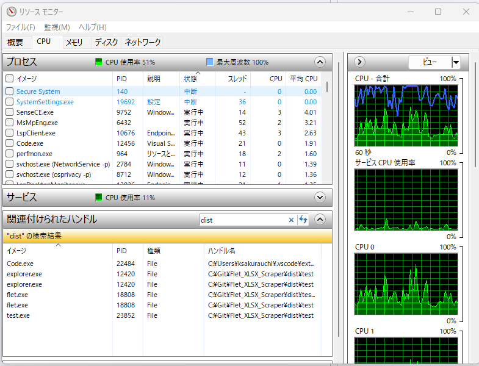
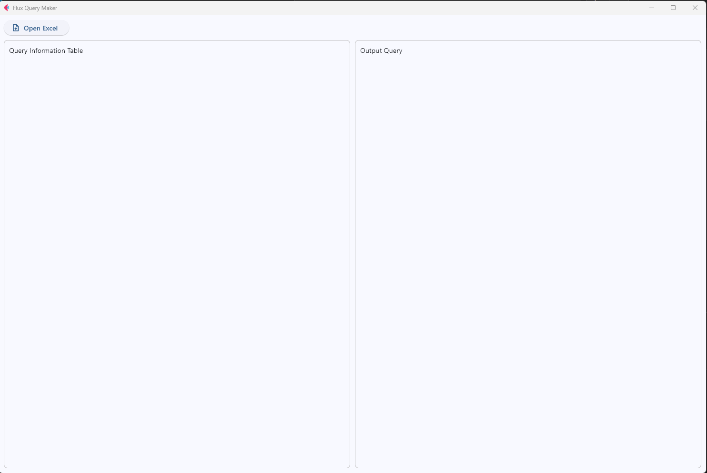
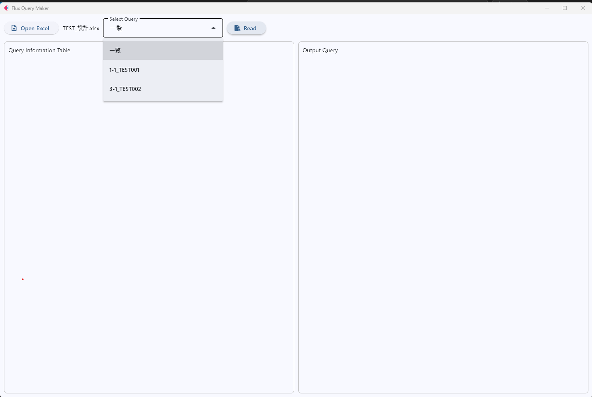
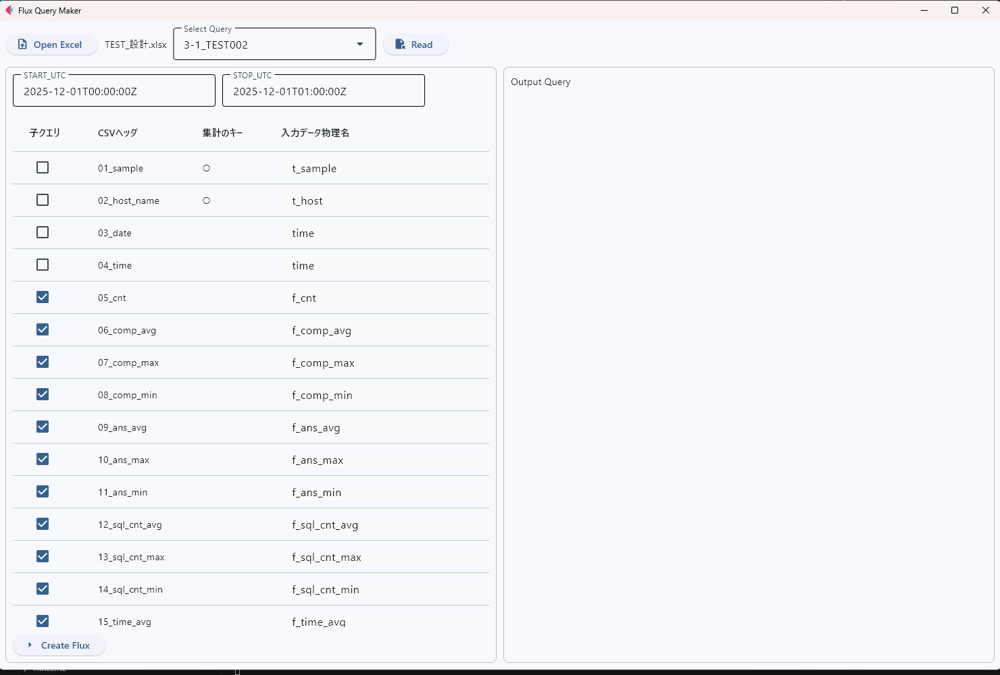
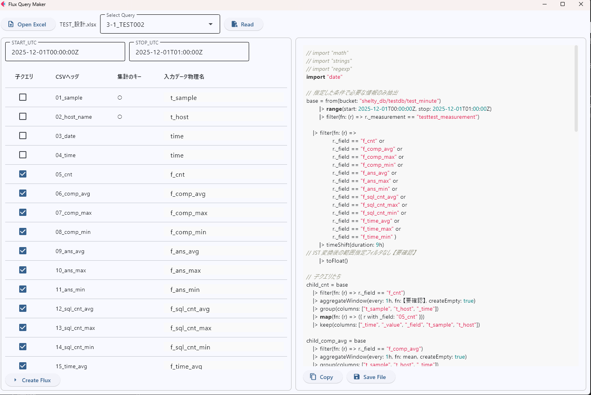

# Flet app
VS code上Ctrl+Shift+VでMarkdownのプレビューが確認できます

## 目次
- [Flet app](#flet-app)
  - [目次](#目次)
  - [構成](#構成)
  - [使い方](#使い方)
    - [環境構築](#環境構築)
    - [ビルド方法(Visual Studio必要)](#ビルド方法visual-studio必要)
      - [失敗する場合](#失敗する場合)
    - [ビルドせずに実行する場合](#ビルドせずに実行する場合)
  - [GUI使い方](#gui使い方)
    - [ファイル読み込み](#ファイル読み込み)
    - [クエリ作成](#クエリ作成)
      - [※確認観点](#確認観点)
    - [クエリ確認](#クエリ確認)
  - [注意点](#注意点)


## 構成
```
FLET_XLSX_SCRAPER/
├─ dist : ビルド後のファイル格納先
├─ src
│       handlers.py : UI操作時の処理
│       main.py     : flet runで実行される
│       utility.py  : UI初期化など
│
├─ assets
│       icon.png            : 変更すればビルド時のアイコン変更？
│       splash_android.png
│
└─ CreateFluxQuery
        Get_query_dataframe.py     : Excel → Dataframe変換
        Get_template_parameter.py  : Dataframe → Parameter変換
        main.py                    : GUI化前に使用していた、メンテしていない
        Make_Flux_File.py          : TemplateにParameterを適用
        Parameter.py               : 内部処理で使用するパラメータなど
        Template                   : 出力するFluxファイルのテンプレート
```

## 使い方
### 環境構築
VScode上Ctrl+@でコンソール起動
``` bash
# 仮想環境作成
python -m venv venv
.\venv\Scripts\activate
pip install -r requirement.txt
```

### ビルド方法(Visual Studio必要)
※Windows環境を想定  
Visual studio Installerで「変更」→ 「C++によるデスクトップ開発」をインストールしておく
``` bash
flet pack src/main.py --name <.exeファイル名> --onedir --add-data "src/CreateFluxQuery/Template;src/CreateFluxQuery" # Templateは明示的に含める
# requirement.txtで足りている理解だが、不足していたらFlutterのインストールを要求されるのでyes
# dist内にexeファイル作成
```

#### 失敗する場合
環境の確認
``` bash
# FlutterのPathを通すとflutterコマンドが使用できるようになるので、flutter doctorで環境を確認
$env:Path += ";C:\Users\<ユーザ名>\flutter\3.38.7\bin;C:\Users\<ユーザ名>\flutter\3.38.7\bin\cache\dart-sdk\bin"
flutter doctor
# flutter doctorの結果がAndroidToolchain以外OKか確認
```
flet buildでビルドを試してみる
``` bash
flet build windows 
```
ビルドコマンド実行後、以前作成したdist内のファイルが消せずにFailすることがある
``` bash
(venv) PS C:\Git\Flet_XLSX_Scraper> flet pack .\src\main.py --onedir --add-data "src/assets:assets" --add-data "src/CreateFluxQuery:src/CreateFluxQuery"
Do you want to delete "build" directory? (y/n) y
Do you want to delete "dist" directory? (y/n) y
Updating Flet View version info 

:
:

169654 INFO: Embedding manifest in EXE
169789 INFO: Appending PKG archive to EXE
170028 INFO: Fixing EXE headers
174697 INFO: Building EXE from EXE-00.toc completed successfully.
174704 INFO: checking COLLECT
174704 INFO: Building COLLECT because COLLECT-00.toc is non existent
174704 INFO: Removing dir C:\Git\Flet_XLSX_Scraper\dist\main
Traceback (most recent call last):
  File "C:\Git\Flet_XLSX_Scraper\venv\Lib\site-packages\PyInstaller\building\utils.py", line 394, in _make_clean_directory
    os.remove(path)
PermissionError: [WinError 5] アクセスが拒否されました。: 'C:\\Git\\Flet_XLSX_Scraper\\dist\\main'

During handling of the above exception, another exception occurred:

Traceback (most recent call last):
  File "<frozen runpy>", line 198, in _run_module_as_main
  File "<frozen runpy>", line 88, in _run_code
  File "C:\Git\Flet_XLSX_Scraper\venv\Scripts\flet.exe\__main__.py", line 7, in <module>
  File "C:\Git\Flet_XLSX_Scraper\venv\Lib\site-packages\flet\cli.py", line 8, in main
    flet_cli.cli.main()
  File "C:\Git\Flet_XLSX_Scraper\venv\Lib\site-packages\flet_cli\cli.py", line 115, in main
    args.handler(args)
  File "C:\Git\Flet_XLSX_Scraper\venv\Lib\site-packages\flet_cli\commands\pack.py", line 318, in handle
    PyInstaller.__main__.run(pyi_args)
  File "C:\Git\Flet_XLSX_Scraper\venv\Lib\site-packages\PyInstaller\__main__.py", line 215, in run
    run_build(pyi_config, spec_file, **vars(args))
  File "C:\Git\Flet_XLSX_Scraper\venv\Lib\site-packages\PyInstaller\__main__.py", line 70, in run_build
    PyInstaller.building.build_main.main(pyi_config, spec_file, **kwargs)
  File "C:\Git\Flet_XLSX_Scraper\venv\Lib\site-packages\PyInstaller\building\build_main.py", line 1275, in main
    build(specfile, distpath, workpath, clean_build)
  File "C:\Git\Flet_XLSX_Scraper\venv\Lib\site-packages\PyInstaller\building\build_main.py", line 1213, in build
    exec(code, spec_namespace)
  File "C:\Git\Flet_XLSX_Scraper\main.spec", line 37, in <module>
    coll = COLLECT(
           ^^^^^^^^
  File "C:\Git\Flet_XLSX_Scraper\venv\Lib\site-packages\PyInstaller\building\api.py", line 1147, in __init__
    self.__postinit__()
  File "C:\Git\Flet_XLSX_Scraper\venv\Lib\site-packages\PyInstaller\building\datastruct.py", line 184, in __postinit__
    self.assemble()
  File "C:\Git\Flet_XLSX_Scraper\venv\Lib\site-packages\PyInstaller\building\api.py", line 1159, in assemble
    _make_clean_directory(self.name)
  File "C:\Git\Flet_XLSX_Scraper\venv\Lib\site-packages\PyInstaller\building\utils.py", line 396, in _make_clean_directory
    _rmtree(path)
  File "C:\Git\Flet_XLSX_Scraper\venv\Lib\site-packages\PyInstaller\building\utils.py", line 421, in _rmtree
    shutil.rmtree(path)
  File "C:\Program Files\WindowsApps\PythonSoftwareFoundation.Python.3.12_3.12.2800.0_x64__qbz5n2kfra8p0\Lib\shutil.py", line 781, in rmtree
    return _rmtree_unsafe(path, onexc)
           ^^^^^^^^^^^^^^^^^^^^^^^^^^^
  File "C:\Program Files\WindowsApps\PythonSoftwareFoundation.Python.3.12_3.12.2800.0_x64__qbz5n2kfra8p0\Lib\shutil.py", line 635, in _rmtree_unsafe
    onexc(os.unlink, fullname, err)
  File "C:\Program Files\WindowsApps\PythonSoftwareFoundation.Python.3.12_3.12.2800.0_x64__qbz5n2kfra8p0\Lib\shutil.py", line 633, in _rmtree_unsafe
    os.unlink(fullname)
PermissionError: [WinError 5] アクセスが拒否されました。: 'C:\\Git\\Flet_XLSX_Scraper\\dist\\main\\_internal\\msgpack\\_cmsgpack.cp312-win_amd64.pyd'
```
exeファイル起動時に同時にコンソールも起動しているが、終了時はそれも閉じないとリソースを握り続けてしまう（調査中）  
上手くいかない場合、リソースモニターでタスキルするのが早い（アプリ検索窓で「resmon」と入力）  
「CPU」タブ→「関連付けられたハンドル」でdistを検索し、flet.exeを右クリックしてプロセスの終了



### ビルドせずに実行する場合
``` bash
flet run # アプリケーションでxを押して閉じるか、コンソール上でCtrl+Cで終了
```

## GUI使い方
### ファイル読み込み
左上「Open Excel」をクリック、読み込みたいExcel設計を選択  
  
Excelのシート名を列挙したドロップダウンが表示されるので、作成したいクエリを選択→右側の「Read」をクリック
  

### クエリ作成
  
左側に、シートの「OUTPUT CSV出力項目ごとの集計処理」の表を読み込んだ結果が表示される  
（表示内容はCSVヘッダ、集計のキー、入力データ物理名、処理、に限定）

表示内容を確認して、問題なければ左下「Create Flux」をクリック
#### ※確認観点
- START_UTC、STOP_UTCが期待の値か（書き換え可能）
- 子クエリ作成対象の項目に過不足ないか（チェックボックスにより変更可能）
- 入力データ物理名に不備はないか（書き換え可能）

### クエリ確認
  
右側に生成されたFluxクエリを表示  
左を修正して再度「Create Flux」すれば再生成可能  

問題なければ、右下の「Copy」でクリップボードにコピー、もしくは「Save File」でファイル保存（デフォルトのファイル名はExcel上の「Fluxクエリーファイル名」に準拠）

## 注意点
- 上手くクエリ生成できなかった部分は【要確認】と表示されるので、手動で修正（表示されるテキストを変更したければ、src/CreateFluxQuery/Parameter.pyの定義を変更）
- Excel上で非表示にされているセルも読み込んでしまうため注意。非表示を使わないor実行前に確認して削除
- アプリケーションの配布時は、dist直下に生成されたディレクトリをすべて配布。exeだけでは動作不可
- 